# Tika — 데이터베이스 ERD

> DB: PostgreSQL (Vercel Postgres / Neon)
> ORM: Drizzle ORM 0.38
> 소스: `src/db/schema.ts`, `docs/TABLE_DEFINITION.md`
> 최종 수정일: 2026-02-26

---

## 1. 테이블 구성 요약

| # | 테이블명 | 설명 | 관계 |
|---|----------|------|------|
| 1 | `users` | Google OAuth 사용자 | 인증 엔티티 |
| 2 | `workspaces` | 워크스페이스 | users 1:N (owner_id FK) |
| 3 | `issues` | 이슈 계층 (Goal/Story/Feature) | workspaces 1:N, self-ref (parent_id) |
| 4 | `members` | 워크스페이스 멤버 | users × workspaces, UNIQUE(user_id, workspace_id) |
| 5 | `tickets` | 칸반 티켓 | workspaces 1:N |
| 6 | `checklist_items` | 체크리스트 항목 | tickets 1:N, ON DELETE CASCADE |
| 7 | `labels` | 라벨 정의 | workspaces 1:N, UNIQUE(workspace_id, name) |
| 8 | `ticket_labels` | 티켓-라벨 매핑 (M:N) | tickets × labels, ON DELETE CASCADE |
| 9 | `notification_channels` | 알림 채널 설정 | workspaces 1:N, UNIQUE(workspace_id, type) |

---

## 2. ERD (PlantUML)

```plantuml
@startuml Tika_Database_ERD
' ─────────────────────────────────────────────────────────
' Tika — Database ER Diagram (PlantUML)
' 소스: docs/TABLE_DEFINITION.md / src/db/schema.ts
' 최종수정: 2026-02-26
' ─────────────────────────────────────────────────────────

' ── Skin / Theme ─────────────────────────────────────────
skinparam backgroundColor #F8F9FB
skinparam defaultFontName  "Noto Sans KR"
skinparam defaultFontSize  12

skinparam entity {
  BackgroundColor       White
  BorderColor           #2C3E50
  HeaderBackgroundColor #629584
  HeaderFontColor       #FFFFFF
  HeaderFontStyle       bold
  AttributeFontColor    #2C3E50
  AttributeFontSize     11
}

skinparam arrow {
  Color     #629584
  FontColor #5A6B7F
  FontSize  10
}

skinparam note {
  BackgroundColor #FEF3C7
  BorderColor     #D97706
  FontSize        10
}

' ── Layout ───────────────────────────────────────────────
left to right direction

' ═══════════════════════════════════════════════════════════
' TABLES
' ═══════════════════════════════════════════════════════════

' ── 1. users ─────────────────────────────────────────────
entity "**users**" as users {
  * id             : TEXT         <<PK>>
  --
  * email          : VARCHAR(255) <<UK>>
  * name           : VARCHAR(100)
    avatar_url     : TEXT
  * created_at     : TIMESTAMPTZ
}

' ── 2. workspaces ────────────────────────────────────────
entity "**workspaces**" as workspaces {
  * id             : SERIAL       <<PK>>
  --
  * name           : VARCHAR(100) DEFAULT '내 워크스페이스'
    description    : TEXT
  * owner_id       : TEXT         <<FK → users.id>>
  * created_at     : TIMESTAMPTZ
}

' ── 3. issues ────────────────────────────────────────────
entity "**issues**" as issues {
  * id             : SERIAL       <<PK>>
  --
  * workspace_id   : INT          <<FK → workspaces.id>>
  * name           : VARCHAR(100)
  * type           : VARCHAR(10)
  .. GOAL | STORY | FEATURE ..
    parent_id      : INT          <<FK → issues.id (self-ref)>>
  * created_at     : TIMESTAMPTZ
  --
  IDX: (workspace_id, type)
  IDX: (parent_id)
}

' ── 4. members ───────────────────────────────────────────
entity "**members**" as members {
  * id             : SERIAL       <<PK>>
  --
  * user_id        : TEXT         <<FK → users.id>>
  * workspace_id   : INT          <<FK → workspaces.id>>
  * display_name   : VARCHAR(50)
  * color          : VARCHAR(7)   DEFAULT '#7EB4A2'
  * role           : VARCHAR(10)  DEFAULT 'member'
  .. admin | member ..
  * created_at     : TIMESTAMPTZ
  --
  UK: (user_id, workspace_id)
}

' ── 5. tickets ───────────────────────────────────────────
entity "**tickets**" as tickets {
  * id             : SERIAL       <<PK>>
  --
  * workspace_id   : INT          <<FK → workspaces.id>>
  * title          : VARCHAR(200)
    description    : TEXT
  * type           : VARCHAR(10)  DEFAULT 'TASK'
  .. GOAL | STORY | FEATURE | TASK ..
  * status         : VARCHAR(20)  DEFAULT 'BACKLOG'
  .. BACKLOG | TODO | IN_PROGRESS | DONE ..
  * priority       : VARCHAR(10)  DEFAULT 'MEDIUM'
  .. LOW | MEDIUM | HIGH | CRITICAL ..
  * position       : INT          DEFAULT 0
    start_date     : DATE
    due_date       : DATE
    issue_id       : INT          <<FK → issues.id, ON DELETE SET NULL>>
    assignee_id    : INT          <<FK → members.id, ON DELETE SET NULL>>
    completed_at   : TIMESTAMPTZ
  * created_at     : TIMESTAMPTZ
  * updated_at     : TIMESTAMPTZ
  --
  IDX: (workspace_id, status, position)
  IDX: (due_date)
}

' ── 6. checklist_items ───────────────────────────────────
entity "**checklist_items**" as checklist_items {
  * id             : SERIAL       <<PK>>
  --
  * ticket_id      : INT          <<FK → tickets.id, ON DELETE CASCADE>>
  * text           : VARCHAR(200)
  * is_completed   : BOOLEAN      DEFAULT false
  * position       : INT          DEFAULT 0
  * created_at     : TIMESTAMPTZ
  --
  IDX: (ticket_id)
  LIMIT: max 20 per ticket
}

' ── 7. labels ────────────────────────────────────────────
entity "**labels**" as labels {
  * id             : SERIAL       <<PK>>
  --
  * workspace_id   : INT          <<FK → workspaces.id>>
  * name           : VARCHAR(20)
  * color          : VARCHAR(7)   DEFAULT '#3B82F6'
  * created_at     : TIMESTAMPTZ
  --
  UK: (workspace_id, name)
  LIMIT: max 20 per workspace
}

' ── 8. ticket_labels (M:N junction) ──────────────────────
entity "**ticket_labels**" as ticket_labels #FAFBFF {
  * ticket_id      : INT          <<PK, FK → tickets.id, ON DELETE CASCADE>>
  * label_id       : INT          <<PK, FK → labels.id, ON DELETE CASCADE>>
  --
  PK: (ticket_id, label_id)
  LIMIT: max 5 labels per ticket
}

' ── 9. notification_channels ─────────────────────────────
entity "**notification_channels**" as notification_channels {
  * id             : SERIAL       <<PK>>
  --
  * workspace_id   : INT          <<FK → workspaces.id>>
  * type           : VARCHAR(20)
  .. slack | telegram ..
  * config         : JSONB
  ..{webhookUrl} | {botToken, chatId}..
  * enabled        : BOOLEAN      DEFAULT false
  * created_at     : TIMESTAMPTZ
  * updated_at     : TIMESTAMPTZ
  --
  UK: (workspace_id, type)
}

' ═══════════════════════════════════════════════════════════
' RELATIONSHIPS (Crow's Foot Notation)
' ─────────────────────────────────────────────────────────
' ||  = exactly one (mandatory)
' o|  = zero or one (optional)
' }|  = one or more (mandatory many)
' }o  = zero or more (optional many)
' ═══════════════════════════════════════════════════════════

' users → workspaces  (1:N via owner_id)
users                ||--o{ workspaces           : "owns\n(owner_id)"

' users → members  (1:N via user_id)
users                ||--o{ members              : "joins as\n(user_id)"

' workspaces → issues  (1:N)
workspaces           ||--|{ issues               : "contains\n(workspace_id)"

' workspaces → members  (1:N)
workspaces           ||--|{ members              : "has member\n(workspace_id)"

' workspaces → tickets  (1:N)
workspaces           ||--|{ tickets              : "contains\n(workspace_id)"

' workspaces → labels  (1:N)
workspaces           ||--o{ labels               : "defines\n(workspace_id)"

' workspaces → notification_channels  (1:N)
workspaces           ||--o{ notification_channels : "notifies via\n(workspace_id)"

' issues → issues  (self-referencing 1:N for hierarchy)
issues               |o--o{ issues               : "parent\n(parent_id)"

' issues → tickets  (1:N via issue_id, optional)
issues               ||--o{ tickets              : "groups\n(issue_id)"

' members → tickets  (1:N via assignee_id, optional)
members              ||--o{ tickets              : "assigned to\n(assignee_id)"

' tickets → checklist_items  (1:N, CASCADE)
tickets              ||--o{ checklist_items       : "has checklist\n(ticket_id)"

' tickets ↔ labels  (M:N via ticket_labels)
tickets              ||--o{ ticket_labels         : "tagged\n(ticket_id)"
labels               ||--o{ ticket_labels         : "applied to\n(label_id)"

' ─────────────────────────────────────────────────────────
' NOTES
' ─────────────────────────────────────────────────────────

note right of tickets
  **칸반 워크플로우**
  BACKLOG → TODO
  → IN_PROGRESS → DONE

  DONE 전환 시 completed_at 자동 설정
  position: gap-based 순서 (예: 65536 단위)
end note

note right of issues
  **이슈 계층 구조**
  GOAL
   └─ STORY
        └─ FEATURE

  tickets.type 에도 TASK 포함하여
  Goal > Story > Feature > Task
  4계층 표현
end note

note bottom of members
  **역할 (RBAC)**
  admin  → 전체 관리 권한
  member → 티켓 CRUD 가능

  향후: OWNER / MEMBER / VIEWER
  3단계로 확장 예정
end note

note bottom of notification_channels
  **config JSONB 예시**
  Slack: {"webhookUrl": "https://..."}
  Telegram: {"botToken": "...",
             "chatId": "..."}
end note

@enduml
```



---

## 3. 관계 요약 (텍스트)

```
users ──1:N──> workspaces
  │                │
  │                ├──1:N──> issues (self-ref: parent_id)
  │                │
  │                ├──1:N──> members
  │                │
  │                ├──1:N──> tickets ──1:N──> checklist_items
  │                │           │
  │                │           ├── FK ──> issues       (issue_id,    ON DELETE SET NULL)
  │                │           ├── FK ──> members      (assignee_id, ON DELETE SET NULL)
  │                │           └── M:N ──> labels      (via ticket_labels, ON DELETE CASCADE)
  │                │
  │                ├──1:N──> labels
  │                │
  │                └──1:N──> notification_channels
  │
  └── FK ──> members (user_id)
```

---

## 4. 테이블 상세 정의

### 4.1 users

Google OAuth로 인증된 사용자 정보를 저장한다.

| 칼럼 | DB 칼럼명 | 타입 | 제약 | 기본값 | 설명 |
|------|----------|------|------|--------|------|
| id | `id` | TEXT | **PK** | — | Google OAuth sub (문자열 ID) |
| email | `email` | VARCHAR(255) | NOT NULL, UNIQUE | — | 이메일 주소 |
| name | `name` | VARCHAR(100) | NOT NULL | — | 사용자 표시 이름 |
| avatarUrl | `avatar_url` | TEXT | NULLABLE | NULL | 프로필 이미지 URL |
| createdAt | `created_at` | TIMESTAMPTZ | NOT NULL | `now()` | 가입 시각 |

**인덱스**: `users_email_unique` → (email)

---

### 4.2 workspaces

사용자의 작업 공간. 최초 로그인 시 기본 워크스페이스가 자동 생성된다.

| 칼럼 | DB 칼럼명 | 타입 | 제약 | 기본값 | 설명 |
|------|----------|------|------|--------|------|
| id | `id` | SERIAL | **PK** | auto-increment | 고유 ID |
| name | `name` | VARCHAR(100) | NOT NULL | `'내 워크스페이스'` | 워크스페이스 이름 (최대 50자) |
| description | `description` | TEXT | NULLABLE | NULL | 워크스페이스 설명 (최대 200자) |
| ownerId | `owner_id` | TEXT | NOT NULL, **FK** → users(id) | — | 소유자 |
| createdAt | `created_at` | TIMESTAMPTZ | NOT NULL | `now()` | 생성 시각 |

---

### 4.3 issues

이슈 계층 구조 (Goal > Story > Feature). 티켓의 상위 개념으로 자기참조 FK를 통해 계층 관계를 표현한다.

| 칼럼 | DB 칼럼명 | 타입 | 제약 | 기본값 | 설명 |
|------|----------|------|------|--------|------|
| id | `id` | SERIAL | **PK** | auto-increment | 고유 ID |
| workspaceId | `workspace_id` | INT | NOT NULL, **FK** → workspaces(id) | — | 소속 워크스페이스 |
| name | `name` | VARCHAR(100) | NOT NULL | — | 이슈 이름 |
| type | `type` | VARCHAR(10) | NOT NULL | — | `GOAL` \| `STORY` \| `FEATURE` |
| parentId | `parent_id` | INT | NULLABLE, **FK** → issues(id) ON DELETE SET NULL | NULL | 상위 이슈 (self-ref) |
| createdAt | `created_at` | TIMESTAMPTZ | NOT NULL | `now()` | 생성 시각 |

**인덱스**:
- `idx_issues_workspace_type` → (workspace_id, type)
- `idx_issues_parent_id` → (parent_id)

**계층 규칙**:
- `GOAL`: `parent_id = null` (최상위)
- `STORY`: `parent_id`는 GOAL 타입 이슈
- `FEATURE`: `parent_id`는 STORY 타입 이슈

---

### 4.4 members

워크스페이스 내 멤버. 사용자가 워크스페이스에 참여하면 자동 생성된다.

| 칼럼 | DB 칼럼명 | 타입 | 제약 | 기본값 | 설명 |
|------|----------|------|------|--------|------|
| id | `id` | SERIAL | **PK** | auto-increment | 고유 ID |
| userId | `user_id` | TEXT | NOT NULL, **FK** → users(id) | — | 연결된 사용자 |
| workspaceId | `workspace_id` | INT | NOT NULL, **FK** → workspaces(id) | — | 소속 워크스페이스 |
| displayName | `display_name` | VARCHAR(50) | NOT NULL | — | 표시 이름 |
| color | `color` | VARCHAR(7) | NOT NULL | `'#7EB4A2'` | 아바타 배경 HEX 색상 |
| role | `role` | VARCHAR(10) | NOT NULL | `'member'` | 역할: `admin` \| `member` |
| createdAt | `created_at` | TIMESTAMPTZ | NOT NULL | `now()` | 생성 시각 |

**유니크 제약**: `members_user_workspace_unique` → (user_id, workspace_id)

---

### 4.5 tickets

칸반 보드의 핵심 엔티티. 4단계 워크플로우를 가진다.

| 칼럼 | DB 칼럼명 | 타입 | 제약 | 기본값 | 설명 |
|------|----------|------|------|--------|------|
| id | `id` | SERIAL | **PK** | auto-increment | 고유 ID |
| workspaceId | `workspace_id` | INT | NOT NULL, **FK** → workspaces(id) | — | 소속 워크스페이스 |
| title | `title` | VARCHAR(200) | NOT NULL | — | 제목 (1~200자) |
| description | `description` | TEXT | NULLABLE | NULL | 설명 (최대 1,000자) |
| type | `type` | VARCHAR(10) | NOT NULL | `'TASK'` | `GOAL` \| `STORY` \| `FEATURE` \| `TASK` |
| status | `status` | VARCHAR(20) | NOT NULL | `'BACKLOG'` | `BACKLOG` \| `TODO` \| `IN_PROGRESS` \| `DONE` |
| priority | `priority` | VARCHAR(10) | NOT NULL | `'MEDIUM'` | `LOW` \| `MEDIUM` \| `HIGH` \| `CRITICAL` |
| position | `position` | INT | NOT NULL | `0` | 칼럼 내 정렬 순서 (gap-based) |
| startDate | `start_date` | DATE | NULLABLE | NULL | 시작일 (YYYY-MM-DD) |
| dueDate | `due_date` | DATE | NULLABLE | NULL | 마감일 (YYYY-MM-DD) |
| issueId | `issue_id` | INT | NULLABLE, **FK** → issues(id) ON DELETE SET NULL | NULL | 상위 이슈 |
| assigneeId | `assignee_id` | INT | NULLABLE, **FK** → members(id) ON DELETE SET NULL | NULL | 담당자 |
| completedAt | `completed_at` | TIMESTAMPTZ | NULLABLE | NULL | 완료 시각 (DONE 전환 시 자동 설정) |
| createdAt | `created_at` | TIMESTAMPTZ | NOT NULL | `now()` | 생성 시각 |
| updatedAt | `updated_at` | TIMESTAMPTZ | NOT NULL | `now()` | 수정 시각 (`$onUpdate`) |

**인덱스**:
- `idx_tickets_workspace_status_position` → (workspace_id, status, position)
- `idx_tickets_due_date` → (due_date)

---

### 4.6 checklist_items

티켓에 소속된 체크리스트 항목. 티켓 삭제 시 CASCADE로 함께 삭제된다.

| 칼럼 | DB 칼럼명 | 타입 | 제약 | 기본값 | 설명 |
|------|----------|------|------|--------|------|
| id | `id` | SERIAL | **PK** | auto-increment | 고유 ID |
| ticketId | `ticket_id` | INT | NOT NULL, **FK** → tickets(id) ON DELETE CASCADE | — | 소속 티켓 |
| text | `text` | VARCHAR(200) | NOT NULL | — | 항목 내용 (1~200자) |
| isCompleted | `is_completed` | BOOLEAN | NOT NULL | `false` | 완료 여부 |
| position | `position` | INT | NOT NULL | `0` | 정렬 순서 |
| createdAt | `created_at` | TIMESTAMPTZ | NOT NULL | `now()` | 생성 시각 |

**인덱스**: `idx_checklist_items_ticket_id` → (ticket_id)

**제한**: 티켓당 최대 20개 (앱 레벨 제어)

---

### 4.7 labels

워크스페이스 단위의 라벨 정의.

| 칼럼 | DB 칼럼명 | 타입 | 제약 | 기본값 | 설명 |
|------|----------|------|------|--------|------|
| id | `id` | SERIAL | **PK** | auto-increment | 고유 ID |
| workspaceId | `workspace_id` | INT | NOT NULL, **FK** → workspaces(id) | — | 소속 워크스페이스 |
| name | `name` | VARCHAR(20) | NOT NULL | — | 라벨 이름 (1~20자) |
| color | `color` | VARCHAR(7) | NOT NULL | `'#3B82F6'` | 라벨 색상 (HEX #RRGGBB) |
| createdAt | `created_at` | TIMESTAMPTZ | NOT NULL | `now()` | 생성 시각 |

**유니크 제약**: `labels_workspace_name_unique` → (workspace_id, name)

**제한**: 워크스페이스당 최대 20개 (앱 레벨 제어)

---

### 4.8 ticket_labels

티켓과 라벨의 다대다(M:N) 매핑 테이블.

| 칼럼 | DB 칼럼명 | 타입 | 제약 | 설명 |
|------|----------|------|------|------|
| ticketId | `ticket_id` | INT | **PK(복합)**, **FK** → tickets(id) ON DELETE CASCADE | 티켓 참조 |
| labelId | `label_id` | INT | **PK(복합)**, **FK** → labels(id) ON DELETE CASCADE | 라벨 참조 |

**PK**: (ticket_id, label_id) — 복합 기본키

**제한**: 티켓당 최대 5개 라벨 (앱 레벨 제어)

---

### 4.9 notification_channels

워크스페이스별 알림 채널 설정 (Slack/Telegram). 채널 타입당 1개 (upsert).

| 칼럼 | DB 칼럼명 | 타입 | 제약 | 기본값 | 설명 |
|------|----------|------|------|--------|------|
| id | `id` | SERIAL | **PK** | auto-increment | 고유 ID |
| workspaceId | `workspace_id` | INT | NOT NULL, **FK** → workspaces(id) | — | 소속 워크스페이스 |
| type | `type` | VARCHAR(20) | NOT NULL | — | 채널 타입: `slack` \| `telegram` |
| config | `config` | JSONB | NOT NULL | — | 채널 설정 JSON |
| enabled | `enabled` | BOOLEAN | NOT NULL | `false` | 활성화 여부 |
| createdAt | `created_at` | TIMESTAMPTZ | NOT NULL | `now()` | 생성 시각 |
| updatedAt | `updated_at` | TIMESTAMPTZ | NOT NULL | `now()` | 수정 시각 |

**유니크 제약**: `notification_channels_workspace_type_unique` → (workspace_id, type)

**config JSONB 예시**:
```json
// Slack
{ "webhookUrl": "https://hooks.slack.com/..." }

// Telegram
{ "botToken": "1234567890:AAF...", "chatId": "-100123456789" }
```

---

## 5. FK 삭제 정책 요약

| 관계 | ON DELETE 정책 | 설명 |
|------|---------------|------|
| workspaces.owner_id → users.id | (기본: RESTRICT) | 사용자 삭제 시 워크스페이스도 보호 |
| members.user_id → users.id | (기본: RESTRICT) | — |
| issues.workspace_id → workspaces.id | (기본: RESTRICT) | — |
| issues.parent_id → issues.id | **SET NULL** | 상위 이슈 삭제 시 하위는 고아 처리 |
| members.workspace_id → workspaces.id | (기본: RESTRICT) | — |
| tickets.workspace_id → workspaces.id | (기본: RESTRICT) | — |
| tickets.issue_id → issues.id | **SET NULL** | 이슈 삭제 시 티켓 연결 해제 |
| tickets.assignee_id → members.id | **SET NULL** | 멤버 삭제 시 담당자 해제 |
| checklist_items.ticket_id → tickets.id | **CASCADE** | 티켓 삭제 시 체크리스트 함께 삭제 |
| labels.workspace_id → workspaces.id | (기본: RESTRICT) | — |
| ticket_labels.ticket_id → tickets.id | **CASCADE** | 티켓 삭제 시 라벨 매핑 삭제 |
| ticket_labels.label_id → labels.id | **CASCADE** | 라벨 삭제 시 매핑 삭제 |
| notification_channels.workspace_id → workspaces.id | (기본: RESTRICT) | — |

---

## 6. 마이그레이션 이력

| 파일 | 설명 |
|------|------|
| `0000_curvy_nocturne.sql` | 초기 스키마 (8개 테이블 전체 생성) |
| `0001_productive_iron_man.sql` | `start_date` 칼럼 추가 (tickets) |
| `0002_dry_raider.sql` | `description` 추가 (workspaces), `role` 추가 (members), `notification_channels` 테이블 신규 생성 |
