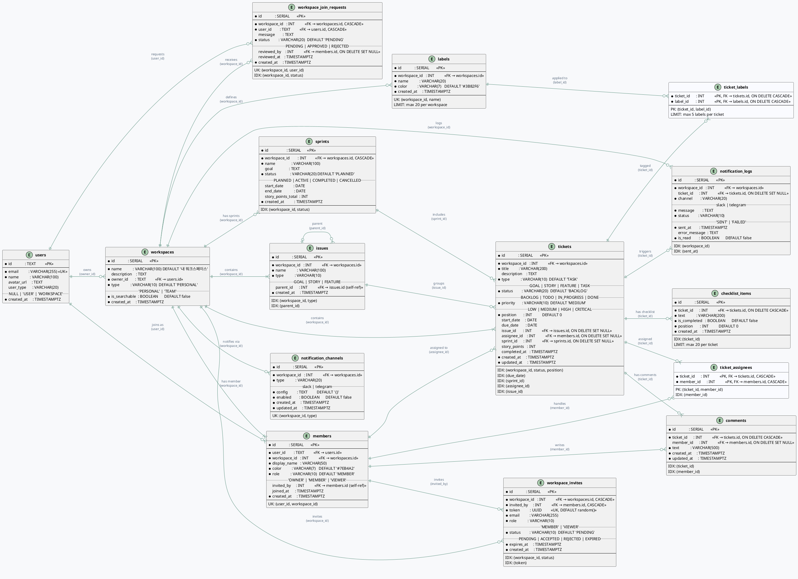

# Tika — 데이터베이스 ERD

> DB: PostgreSQL (Vercel Postgres / Neon)
> ORM: Drizzle ORM 0.38
> 소스: `src/db/schema.ts`, `docs/TABLE_DEFINITION.md`
> 최종 수정일: 2026-03-07

---

## 1. 테이블 구성 요약

| # | 테이블명 | 설명 | 관계 |
|---|----------|------|------|
| 1 | `users` | Google OAuth 사용자 | 인증 엔티티 |
| 2 | `workspaces` | 워크스페이스 | users 1:N (owner_id FK) |
| 3 | `issues` | 이슈 계층 (Goal/Story/Feature) | workspaces 1:N, self-ref (parent_id) |
| 4 | `members` | 워크스페이스 멤버 | users × workspaces, UNIQUE(user_id, workspace_id) |
| 5 | `sprints` | 스프린트 | workspaces 1:N (ON DELETE CASCADE) |
| 6 | `tickets` | 칸반 티켓 | workspaces 1:N, sprints FK |
| 7 | `checklist_items` | 체크리스트 항목 | tickets 1:N, ON DELETE CASCADE |
| 8 | `labels` | 라벨 정의 | workspaces 1:N, UNIQUE(workspace_id, name) |
| 9 | `ticket_labels` | 티켓-라벨 매핑 (M:N) | tickets × labels, ON DELETE CASCADE |
| 10 | `notification_channels` | 알림 채널 설정 | workspaces 1:N, UNIQUE(workspace_id, type) |
| 11 | `comments` | 티켓 댓글 | tickets 1:N (CASCADE), members FK (SET NULL) |
| 12 | `notification_logs` | 알림 발송 이력 | workspaces 1:N, tickets FK (SET NULL) |
| 13 | `workspace_invites` | 초대 토큰 | workspaces 1:N (CASCADE), members (invitedBy) |
| 14 | `ticket_assignees` | 다중 담당자 (M:N) | tickets × members, ON DELETE CASCADE |
| 15 | `workspace_join_requests` | 워크스페이스 가입 요청 | workspaces × users, UNIQUE(workspace_id, user_id) |

---

## 2. ERD (PlantUML)


```plantuml
@startuml Tika_Database_ERD
' ─────────────────────────────────────────────────────────
' Tika — Database ER Diagram (PlantUML)
' 소스: docs/TABLE_DEFINITION.md / src/db/schema.ts
' 최종수정: 2026-03-07
' ─────────────────────────────────────────────────────────

' ── Skin / Theme ─────────────────────────────────────────
skinparam backgroundColor #F8F9FB
skinparam defaultFontName  "Noto Sans KR"
skinparam defaultFontSize  12

skinparam entity {
  BackgroundColor       White
  BorderColor           #2C3E50
  HeaderBackgroundColor #629584
  HeaderFontColor       #FFFFFF
  HeaderFontStyle       bold
  AttributeFontColor    #2C3E50
  AttributeFontSize     11
}

skinparam arrow {
  Color     #629584
  FontColor #5A6B7F
  FontSize  10
}

skinparam note {
  BackgroundColor #FEF3C7
  BorderColor     #D97706
  FontSize        10
}

' ── Layout ───────────────────────────────────────────────
left to right direction

' ═══════════════════════════════════════════════════════════
' TABLES
' ═══════════════════════════════════════════════════════════

' ── 1. users ─────────────────────────────────────────────
entity "**users**" as users {
  * id             : TEXT         <<PK>>
  --
  * email          : VARCHAR(255) <<UK>>
  * name           : VARCHAR(100)
    avatar_url     : TEXT
    user_type      : VARCHAR(20)
  .. NULL | 'USER' | 'WORKSPACE' ..
  * created_at     : TIMESTAMPTZ
}

' ── 2. workspaces ────────────────────────────────────────
entity "**workspaces**" as workspaces {
  * id             : SERIAL       <<PK>>
  --
  * name           : VARCHAR(100) DEFAULT '내 워크스페이스'
    description    : TEXT
  * owner_id       : TEXT         <<FK → users.id>>
  * type           : VARCHAR(10)  DEFAULT 'PERSONAL'
  .. 'PERSONAL' | 'TEAM' ..
  * is_searchable  : BOOLEAN      DEFAULT false
  * created_at     : TIMESTAMPTZ
}

' ── 3. issues ────────────────────────────────────────────
entity "**issues**" as issues {
  * id             : SERIAL       <<PK>>
  --
  * workspace_id   : INT          <<FK → workspaces.id>>
  * name           : VARCHAR(100)
  * type           : VARCHAR(10)
  .. GOAL | STORY | FEATURE ..
    parent_id      : INT          <<FK → issues.id (self-ref)>>
  * created_at     : TIMESTAMPTZ
  --
  IDX: (workspace_id, type)
  IDX: (parent_id)
}

' ── 4. members ───────────────────────────────────────────
entity "**members**" as members {
  * id             : SERIAL       <<PK>>
  --
  * user_id        : TEXT         <<FK → users.id>>
  * workspace_id   : INT          <<FK → workspaces.id>>
  * display_name   : VARCHAR(50)
  * color          : VARCHAR(7)   DEFAULT '#7EB4A2'
  * role           : VARCHAR(10)  DEFAULT 'MEMBER'
  .. 'OWNER' | 'MEMBER' | 'VIEWER' ..
    invited_by     : INT          <<FK → members.id (self-ref)>>
    joined_at      : TIMESTAMPTZ
  * created_at     : TIMESTAMPTZ
  --
  UK: (user_id, workspace_id)
}

' ── 5. sprints ───────────────────────────────────────────
entity "**sprints**" as sprints {
  * id                  : SERIAL      <<PK>>
  --
  * workspace_id        : INT         <<FK → workspaces.id, CASCADE>>
  * name                : VARCHAR(100)
    goal                : TEXT
  * status              : VARCHAR(20) DEFAULT 'PLANNED'
  .. PLANNED | ACTIVE | COMPLETED | CANCELLED ..
    start_date          : DATE
    end_date            : DATE
    story_points_total  : INT
  * created_at          : TIMESTAMPTZ
  --
  IDX: (workspace_id, status)
}

' ── 6. tickets ───────────────────────────────────────────
entity "**tickets**" as tickets {
  * id             : SERIAL       <<PK>>
  --
  * workspace_id   : INT          <<FK → workspaces.id>>
  * title          : VARCHAR(200)
    description    : TEXT
  * type           : VARCHAR(10)  DEFAULT 'TASK'
  .. GOAL | STORY | FEATURE | TASK ..
  * status         : VARCHAR(20)  DEFAULT 'BACKLOG'
  .. BACKLOG | TODO | IN_PROGRESS | DONE ..
  * priority       : VARCHAR(10)  DEFAULT 'MEDIUM'
  .. LOW | MEDIUM | HIGH | CRITICAL ..
  * position       : INT          DEFAULT 0
    start_date     : DATE
    due_date       : DATE
    issue_id       : INT          <<FK → issues.id, ON DELETE SET NULL>>
    assignee_id    : INT          <<FK → members.id, ON DELETE SET NULL>>
    sprint_id      : INT          <<FK → sprints.id, ON DELETE SET NULL>>
    story_points   : INT
    completed_at   : TIMESTAMPTZ
  * created_at     : TIMESTAMPTZ
  * updated_at     : TIMESTAMPTZ
  --
  IDX: (workspace_id, status, position)
  IDX: (due_date)
  IDX: (sprint_id)
  IDX: (assignee_id)
  IDX: (issue_id)
}

' ── 7. checklist_items ───────────────────────────────────
entity "**checklist_items**" as checklist_items {
  * id             : SERIAL       <<PK>>
  --
  * ticket_id      : INT          <<FK → tickets.id, ON DELETE CASCADE>>
  * text           : VARCHAR(200)
  * is_completed   : BOOLEAN      DEFAULT false
  * position       : INT          DEFAULT 0
  * created_at     : TIMESTAMPTZ
  --
  IDX: (ticket_id)
  LIMIT: max 20 per ticket
}

' ── 8. labels ────────────────────────────────────────────
entity "**labels**" as labels {
  * id             : SERIAL       <<PK>>
  --
  * workspace_id   : INT          <<FK → workspaces.id>>
  * name           : VARCHAR(20)
  * color          : VARCHAR(7)   DEFAULT '#3B82F6'
  * created_at     : TIMESTAMPTZ
  --
  UK: (workspace_id, name)
  LIMIT: max 20 per workspace
}

' ── 9. ticket_labels (M:N junction) ──────────────────────
entity "**ticket_labels**" as ticket_labels #FAFBFF {
  * ticket_id      : INT          <<PK, FK → tickets.id, ON DELETE CASCADE>>
  * label_id       : INT          <<PK, FK → labels.id, ON DELETE CASCADE>>
  --
  PK: (ticket_id, label_id)
  LIMIT: max 5 labels per ticket
}

' ── 10. notification_channels ─────────────────────────────
entity "**notification_channels**" as notification_channels {
  * id             : SERIAL       <<PK>>
  --
  * workspace_id   : INT          <<FK → workspaces.id>>
  * type           : VARCHAR(20)
  .. slack | telegram ..
  * config         : TEXT         DEFAULT '{}'
  * enabled        : BOOLEAN      DEFAULT false
  * created_at     : TIMESTAMPTZ
  * updated_at     : TIMESTAMPTZ
  --
  UK: (workspace_id, type)
}

' ── 11. comments ─────────────────────────────────────────
entity "**comments**" as comments {
  * id             : SERIAL       <<PK>>
  --
  * ticket_id      : INT          <<FK → tickets.id, ON DELETE CASCADE>>
    member_id      : INT          <<FK → members.id, ON DELETE SET NULL>>
  * text           : VARCHAR(500)
  * created_at     : TIMESTAMPTZ
  * updated_at     : TIMESTAMPTZ
  --
  IDX: (ticket_id)
  IDX: (member_id)
}

' ── 12. notification_logs ────────────────────────────────
entity "**notification_logs**" as notification_logs {
  * id             : SERIAL       <<PK>>
  --
  * workspace_id   : INT          <<FK → workspaces.id>>
    ticket_id      : INT          <<FK → tickets.id, ON DELETE SET NULL>>
  * channel        : VARCHAR(20)
  .. slack | telegram ..
  * message        : TEXT
  * status         : VARCHAR(10)
  .. 'SENT' | 'FAILED' ..
  * sent_at        : TIMESTAMPTZ
    error_message  : TEXT
  * is_read        : BOOLEAN      DEFAULT false
  --
  IDX: (workspace_id)
  IDX: (sent_at)
}

' ── 13. workspace_invites ────────────────────────────────
entity "**workspace_invites**" as workspace_invites {
  * id             : SERIAL       <<PK>>
  --
  * workspace_id   : INT          <<FK → workspaces.id, CASCADE>>
  * invited_by     : INT          <<FK → members.id, CASCADE>>
  * token          : UUID         <<UK, DEFAULT random()>>
  * email          : VARCHAR(255)
  * role           : VARCHAR(10)
  .. 'MEMBER' | 'VIEWER' ..
  * status         : VARCHAR(10)  DEFAULT 'PENDING'
  .. PENDING | ACCEPTED | REJECTED | EXPIRED ..
  * expires_at     : TIMESTAMPTZ
  * created_at     : TIMESTAMPTZ
  --
  IDX: (workspace_id, status)
  IDX: (token)
}

' ── 14. ticket_assignees (M:N) ───────────────────────────
entity "**ticket_assignees**" as ticket_assignees #FAFBFF {
  * ticket_id      : INT          <<PK, FK → tickets.id, CASCADE>>
  * member_id      : INT          <<PK, FK → members.id, CASCADE>>
  --
  PK: (ticket_id, member_id)
  IDX: (member_id)
}

' ── 15. workspace_join_requests ──────────────────────────
entity "**workspace_join_requests**" as workspace_join_requests {
  * id             : SERIAL       <<PK>>
  --
  * workspace_id   : INT          <<FK → workspaces.id, CASCADE>>
  * user_id        : TEXT         <<FK → users.id, CASCADE>>
    message        : TEXT
  * status         : VARCHAR(20)  DEFAULT 'PENDING'
  .. PENDING | APPROVED | REJECTED ..
    reviewed_by    : INT          <<FK → members.id, ON DELETE SET NULL>>
    reviewed_at    : TIMESTAMPTZ
  * created_at     : TIMESTAMPTZ
  --
  UK: (workspace_id, user_id)
  IDX: (workspace_id, status)
}

' ═══════════════════════════════════════════════════════════
' RELATIONSHIPS (Crow's Foot Notation)
' ═══════════════════════════════════════════════════════════

' users → workspaces  (1:N via owner_id)
users                ||--o{ workspaces           : "owns\n(owner_id)"

' users → members  (1:N via user_id)
users                ||--o{ members              : "joins as\n(user_id)"

' users → workspace_join_requests
users                ||--o{ workspace_join_requests : "requests\n(user_id)"

' workspaces → issues  (1:N)
workspaces           ||--|{ issues               : "contains\n(workspace_id)"

' workspaces → members  (1:N)
workspaces           ||--|{ members              : "has member\n(workspace_id)"

' workspaces → sprints  (1:N)
workspaces           ||--o{ sprints              : "has sprints\n(workspace_id)"

' workspaces → tickets  (1:N)
workspaces           ||--|{ tickets              : "contains\n(workspace_id)"

' workspaces → labels  (1:N)
workspaces           ||--o{ labels               : "defines\n(workspace_id)"

' workspaces → notification_channels  (1:N)
workspaces           ||--o{ notification_channels : "notifies via\n(workspace_id)"

' workspaces → notification_logs  (1:N)
workspaces           ||--o{ notification_logs    : "logs\n(workspace_id)"

' workspaces → workspace_invites  (1:N)
workspaces           ||--o{ workspace_invites    : "invites\n(workspace_id)"

' workspaces → workspace_join_requests  (1:N)
workspaces           ||--o{ workspace_join_requests : "receives\n(workspace_id)"

' issues → issues  (self-referencing 1:N for hierarchy)
issues               |o--o{ issues               : "parent\n(parent_id)"

' issues → tickets  (1:N via issue_id, optional)
issues               ||--o{ tickets              : "groups\n(issue_id)"

' sprints → tickets  (1:N)
sprints              ||--o{ tickets              : "includes\n(sprint_id)"

' members → tickets  (1:N via assignee_id, optional)
members              ||--o{ tickets              : "assigned to\n(assignee_id)"

' members → comments  (1:N)
members              ||--o{ comments             : "writes\n(member_id)"

' members → workspace_invites  (1:N via invited_by)
members              ||--o{ workspace_invites    : "invites\n(invited_by)"

' tickets → checklist_items  (1:N, CASCADE)
tickets              ||--o{ checklist_items       : "has checklist\n(ticket_id)"

' tickets → comments  (1:N, CASCADE)
tickets              ||--o{ comments             : "has comments\n(ticket_id)"

' tickets → notification_logs  (1:N)
tickets              ||--o{ notification_logs    : "triggers\n(ticket_id)"

' tickets ↔ labels  (M:N via ticket_labels)
tickets              ||--o{ ticket_labels         : "tagged\n(ticket_id)"
labels               ||--o{ ticket_labels         : "applied to\n(label_id)"

' tickets ↔ members  (M:N via ticket_assignees)
tickets              ||--o{ ticket_assignees      : "assigned\n(ticket_id)"
members              ||--o{ ticket_assignees      : "handles\n(member_id)"

@enduml
```

---

## 3. 관계 요약 (텍스트)

```
users ──1:N──> workspaces
  │                │
  │                ├──1:N──> issues (self-ref: parent_id)
  │                │
  │                ├──1:N──> members ──self-ref──> invited_by
  │                │
  │                ├──1:N──> sprints
  │                │           │
  │                │           └──1:N──> tickets
  │                │
  │                ├──1:N──> tickets ──1:N──> checklist_items
  │                │           │           ──1:N──> comments
  │                │           │           ──1:N──> notification_logs
  │                │           ├── FK ──> issues       (issue_id,    ON DELETE SET NULL)
  │                │           ├── FK ──> members      (assignee_id, ON DELETE SET NULL)
  │                │           ├── FK ──> sprints      (sprint_id,   ON DELETE SET NULL)
  │                │           ├── M:N ──> labels      (via ticket_labels,    CASCADE)
  │                │           └── M:N ──> members     (via ticket_assignees, CASCADE)
  │                │
  │                ├──1:N──> labels
  │                ├──1:N──> notification_channels
  │                ├──1:N──> workspace_invites
  │                └──1:N──> workspace_join_requests
  │
  ├── FK ──> members (user_id)
  └── FK ──> workspace_join_requests (user_id)
```

---

## 4. 테이블 상세 정의

### 4.1 users

Google OAuth로 인증된 사용자 정보를 저장한다.

| 칼럼 | DB 칼럼명 | 타입 | 제약 | 기본값 | 설명 |
|------|----------|------|------|--------|------|
| id | `id` | TEXT | **PK** | — | Google OAuth sub (문자열 ID) |
| email | `email` | VARCHAR(255) | NOT NULL, UNIQUE | — | 이메일 주소 |
| name | `name` | VARCHAR(100) | NOT NULL | — | 사용자 표시 이름 |
| avatarUrl | `avatar_url` | TEXT | NULLABLE | NULL | 프로필 이미지 URL |
| userType | `user_type` | VARCHAR(20) | NULLABLE | NULL | NULL=온보딩 미완료 \| `'USER'` \| `'WORKSPACE'` |
| createdAt | `created_at` | TIMESTAMPTZ | NOT NULL | `now()` | 가입 시각 |

**인덱스**: `users_email_unique` → (email)

---

### 4.2 workspaces

사용자의 작업 공간. 최초 로그인 시 기본 워크스페이스가 자동 생성된다.

| 칼럼 | DB 칼럼명 | 타입 | 제약 | 기본값 | 설명 |
|------|----------|------|------|--------|------|
| id | `id` | SERIAL | **PK** | auto-increment | 고유 ID |
| name | `name` | VARCHAR(100) | NOT NULL | `'내 워크스페이스'` | 워크스페이스 이름 (최대 50자) |
| description | `description` | TEXT | NULLABLE | NULL | 워크스페이스 설명 (최대 200자) |
| ownerId | `owner_id` | TEXT | NOT NULL, **FK** → users(id) | — | 소유자 |
| type | `type` | VARCHAR(10) | NOT NULL | `'PERSONAL'` | `'PERSONAL'` \| `'TEAM'` |
| isSearchable | `is_searchable` | BOOLEAN | NOT NULL | `false` | false=비공개, true=검색 가능 |
| createdAt | `created_at` | TIMESTAMPTZ | NOT NULL | `now()` | 생성 시각 |

---

### 4.3 issues

이슈 계층 구조 (Goal > Story > Feature). 티켓의 상위 개념으로 자기참조 FK를 통해 계층 관계를 표현한다.

| 칼럼 | DB 칼럼명 | 타입 | 제약 | 기본값 | 설명 |
|------|----------|------|------|--------|------|
| id | `id` | SERIAL | **PK** | auto-increment | 고유 ID |
| workspaceId | `workspace_id` | INT | NOT NULL, **FK** → workspaces(id) | — | 소속 워크스페이스 |
| name | `name` | VARCHAR(100) | NOT NULL | — | 이슈 이름 |
| type | `type` | VARCHAR(10) | NOT NULL | — | `GOAL` \| `STORY` \| `FEATURE` |
| parentId | `parent_id` | INT | NULLABLE, **FK** → issues(id) ON DELETE SET NULL | NULL | 상위 이슈 (self-ref) |
| createdAt | `created_at` | TIMESTAMPTZ | NOT NULL | `now()` | 생성 시각 |

**인덱스**:
- `idx_issues_workspace_type` → (workspace_id, type)
- `idx_issues_parent_id` → (parent_id)

---

### 4.4 members

워크스페이스 내 멤버. 사용자가 워크스페이스에 참여하면 자동 생성된다.

| 칼럼 | DB 칼럼명 | 타입 | 제약 | 기본값 | 설명 |
|------|----------|------|------|--------|------|
| id | `id` | SERIAL | **PK** | auto-increment | 고유 ID |
| userId | `user_id` | TEXT | NOT NULL, **FK** → users(id) | — | 연결된 사용자 |
| workspaceId | `workspace_id` | INT | NOT NULL, **FK** → workspaces(id) | — | 소속 워크스페이스 |
| displayName | `display_name` | VARCHAR(50) | NOT NULL | — | 표시 이름 |
| color | `color` | VARCHAR(7) | NOT NULL | `'#7EB4A2'` | 아바타 배경 HEX 색상 |
| role | `role` | VARCHAR(10) | NOT NULL | `'MEMBER'` | 역할: `'OWNER'` \| `'MEMBER'` \| `'VIEWER'` |
| invitedBy | `invited_by` | INT | NULLABLE, **FK** → members(id) | NULL | 초대한 멤버 (self-ref) |
| joinedAt | `joined_at` | TIMESTAMPTZ | NULLABLE | NULL | 참여 시각 (null = 워크스페이스 창시자) |
| createdAt | `created_at` | TIMESTAMPTZ | NOT NULL | `now()` | 생성 시각 |

**유니크 제약**: `members_user_workspace_unique` → (user_id, workspace_id)

---

### 4.5 sprints

스프린트 단위 작업 기간 관리.

| 칼럼 | DB 칼럼명 | 타입 | 제약 | 기본값 | 설명 |
|------|----------|------|------|--------|------|
| id | `id` | SERIAL | **PK** | auto-increment | 고유 ID |
| workspaceId | `workspace_id` | INT | NOT NULL, **FK** → workspaces(id) ON DELETE CASCADE | — | 소속 워크스페이스 |
| name | `name` | VARCHAR(100) | NOT NULL | — | 스프린트 이름 |
| goal | `goal` | TEXT | NULLABLE | NULL | 스프린트 목표 |
| status | `status` | VARCHAR(20) | NOT NULL | `'PLANNED'` | `PLANNED` \| `ACTIVE` \| `COMPLETED` \| `CANCELLED` |
| startDate | `start_date` | DATE | NULLABLE | NULL | 시작일 |
| endDate | `end_date` | DATE | NULLABLE | NULL | 종료일 |
| storyPointsTotal | `story_points_total` | INT | NULLABLE | NULL | 계획된 총 스토리 포인트 |
| createdAt | `created_at` | TIMESTAMPTZ | NOT NULL | `now()` | 생성 시각 |

**인덱스**: `idx_sprints_workspace_status` → (workspace_id, status)

---

### 4.6 tickets

칸반 보드의 핵심 엔티티. 4단계 워크플로우를 가진다.

| 칼럼 | DB 칼럼명 | 타입 | 제약 | 기본값 | 설명 |
|------|----------|------|------|--------|------|
| id | `id` | SERIAL | **PK** | auto-increment | 고유 ID |
| workspaceId | `workspace_id` | INT | NOT NULL, **FK** → workspaces(id) | — | 소속 워크스페이스 |
| title | `title` | VARCHAR(200) | NOT NULL | — | 제목 (1~200자) |
| description | `description` | TEXT | NULLABLE | NULL | 설명 (최대 1,000자) |
| type | `type` | VARCHAR(10) | NOT NULL | `'TASK'` | `GOAL` \| `STORY` \| `FEATURE` \| `TASK` |
| status | `status` | VARCHAR(20) | NOT NULL | `'BACKLOG'` | `BACKLOG` \| `TODO` \| `IN_PROGRESS` \| `DONE` |
| priority | `priority` | VARCHAR(10) | NOT NULL | `'MEDIUM'` | `LOW` \| `MEDIUM` \| `HIGH` \| `CRITICAL` |
| position | `position` | INT | NOT NULL | `0` | 칼럼 내 정렬 순서 (gap-based) |
| startDate | `start_date` | DATE | NULLABLE | NULL | 시작일 (YYYY-MM-DD) |
| dueDate | `due_date` | DATE | NULLABLE | NULL | 마감일 (YYYY-MM-DD) |
| issueId | `issue_id` | INT | NULLABLE, **FK** → issues(id) ON DELETE SET NULL | NULL | 상위 이슈 |
| assigneeId | `assignee_id` | INT | NULLABLE, **FK** → members(id) ON DELETE SET NULL | NULL | 단일 담당자 (레거시) |
| sprintId | `sprint_id` | INT | NULLABLE, **FK** → sprints(id) ON DELETE SET NULL | NULL | 소속 스프린트 |
| storyPoints | `story_points` | INT | NULLABLE | NULL | 스토리 포인트 |
| completedAt | `completed_at` | TIMESTAMPTZ | NULLABLE | NULL | 완료 시각 (DONE 전환 시 자동 설정) |
| createdAt | `created_at` | TIMESTAMPTZ | NOT NULL | `now()` | 생성 시각 |
| updatedAt | `updated_at` | TIMESTAMPTZ | NOT NULL | `now()` | 수정 시각 (`$onUpdate`) |

**인덱스**:
- `idx_tickets_workspace_status_position` → (workspace_id, status, position)
- `idx_tickets_due_date` → (due_date)
- `idx_tickets_sprint_id` → (sprint_id)
- `idx_tickets_assignee_id` → (assignee_id)
- `idx_tickets_issue_id` → (issue_id)

---

### 4.7 checklist_items

티켓에 소속된 체크리스트 항목. 티켓 삭제 시 CASCADE로 함께 삭제된다.

| 칼럼 | DB 칼럼명 | 타입 | 제약 | 기본값 | 설명 |
|------|----------|------|------|--------|------|
| id | `id` | SERIAL | **PK** | auto-increment | 고유 ID |
| ticketId | `ticket_id` | INT | NOT NULL, **FK** → tickets(id) ON DELETE CASCADE | — | 소속 티켓 |
| text | `text` | VARCHAR(200) | NOT NULL | — | 항목 내용 (1~200자) |
| isCompleted | `is_completed` | BOOLEAN | NOT NULL | `false` | 완료 여부 |
| position | `position` | INT | NOT NULL | `0` | 정렬 순서 |
| createdAt | `created_at` | TIMESTAMPTZ | NOT NULL | `now()` | 생성 시각 |

**인덱스**: `idx_checklist_items_ticket_id` → (ticket_id)

**제한**: 티켓당 최대 20개 (앱 레벨 제어)

---

### 4.8 labels

워크스페이스 단위의 라벨 정의.

| 칼럼 | DB 칼럼명 | 타입 | 제약 | 기본값 | 설명 |
|------|----------|------|------|--------|------|
| id | `id` | SERIAL | **PK** | auto-increment | 고유 ID |
| workspaceId | `workspace_id` | INT | NOT NULL, **FK** → workspaces(id) | — | 소속 워크스페이스 |
| name | `name` | VARCHAR(20) | NOT NULL | — | 라벨 이름 (1~20자) |
| color | `color` | VARCHAR(7) | NOT NULL | `'#3B82F6'` | 라벨 색상 (HEX #RRGGBB) |
| createdAt | `created_at` | TIMESTAMPTZ | NOT NULL | `now()` | 생성 시각 |

**유니크 제약**: `labels_workspace_name_unique` → (workspace_id, name)

**제한**: 워크스페이스당 최대 20개 (앱 레벨 제어)

---

### 4.9 ticket_labels

티켓과 라벨의 다대다(M:N) 매핑 테이블.

| 칼럼 | DB 칼럼명 | 타입 | 제약 | 설명 |
|------|----------|------|------|------|
| ticketId | `ticket_id` | INT | **PK(복합)**, **FK** → tickets(id) ON DELETE CASCADE | 티켓 참조 |
| labelId | `label_id` | INT | **PK(복합)**, **FK** → labels(id) ON DELETE CASCADE | 라벨 참조 |

**PK**: (ticket_id, label_id) — 복합 기본키

**제한**: 티켓당 최대 5개 라벨 (앱 레벨 제어)

---

### 4.10 notification_channels

워크스페이스별 알림 채널 설정 (Slack/Telegram). 채널 타입당 1개 (upsert).

| 칼럼 | DB 칼럼명 | 타입 | 제약 | 기본값 | 설명 |
|------|----------|------|------|--------|------|
| id | `id` | SERIAL | **PK** | auto-increment | 고유 ID |
| workspaceId | `workspace_id` | INT | NOT NULL, **FK** → workspaces(id) | — | 소속 워크스페이스 |
| type | `type` | VARCHAR(20) | NOT NULL | — | 채널 타입: `slack` \| `telegram` |
| config | `config` | TEXT | NOT NULL | `'{}'` | 채널 설정 JSON 문자열 |
| enabled | `enabled` | BOOLEAN | NOT NULL | `false` | 활성화 여부 |
| createdAt | `created_at` | TIMESTAMPTZ | NOT NULL | `now()` | 생성 시각 |
| updatedAt | `updated_at` | TIMESTAMPTZ | NOT NULL | `now()` | 수정 시각 |

**유니크 제약**: `notification_channels_workspace_type_unique` → (workspace_id, type)

---

### 4.11 comments

티켓 댓글. 티켓 삭제 시 CASCADE 삭제.

| 칼럼 | DB 칼럼명 | 타입 | 제약 | 기본값 | 설명 |
|------|----------|------|------|--------|------|
| id | `id` | SERIAL | **PK** | auto-increment | 고유 ID |
| ticketId | `ticket_id` | INT | NOT NULL, **FK** → tickets(id) ON DELETE CASCADE | — | 소속 티켓 |
| memberId | `member_id` | INT | NULLABLE, **FK** → members(id) ON DELETE SET NULL | NULL | 작성자 |
| text | `text` | VARCHAR(500) | NOT NULL | — | 댓글 내용 |
| createdAt | `created_at` | TIMESTAMPTZ | NOT NULL | `now()` | 생성 시각 |
| updatedAt | `updated_at` | TIMESTAMPTZ | NOT NULL | `now()` | 수정 시각 |

**인덱스**:
- `idx_comments_ticket_id` → (ticket_id)
- `idx_comments_member_id` → (member_id)

---

### 4.12 notification_logs

알림 발송 이력. 읽음 여부 포함.

| 칼럼 | DB 칼럼명 | 타입 | 제약 | 기본값 | 설명 |
|------|----------|------|------|--------|------|
| id | `id` | SERIAL | **PK** | auto-increment | 고유 ID |
| workspaceId | `workspace_id` | INT | NOT NULL, **FK** → workspaces(id) | — | 소속 워크스페이스 |
| ticketId | `ticket_id` | INT | NULLABLE, **FK** → tickets(id) ON DELETE SET NULL | NULL | 관련 티켓 |
| channel | `channel` | VARCHAR(20) | NOT NULL | — | `'slack'` \| `'telegram'` |
| message | `message` | TEXT | NOT NULL | — | 발송 메시지 |
| status | `status` | VARCHAR(10) | NOT NULL | — | `'SENT'` \| `'FAILED'` |
| sentAt | `sent_at` | TIMESTAMPTZ | NOT NULL | `now()` | 발송 시각 |
| errorMessage | `error_message` | TEXT | NULLABLE | NULL | 실패 시 오류 메시지 |
| isRead | `is_read` | BOOLEAN | NOT NULL | `false` | 읽음 여부 |

**인덱스**:
- `idx_notification_logs_workspace_id` → (workspace_id)
- `idx_notification_logs_sent_at` → (sent_at)

---

### 4.13 workspace_invites

워크스페이스 초대 토큰. 만료 기간 있음.

| 칼럼 | DB 칼럼명 | 타입 | 제약 | 기본값 | 설명 |
|------|----------|------|------|--------|------|
| id | `id` | SERIAL | **PK** | auto-increment | 고유 ID |
| workspaceId | `workspace_id` | INT | NOT NULL, **FK** → workspaces(id) ON DELETE CASCADE | — | 대상 워크스페이스 |
| invitedBy | `invited_by` | INT | NOT NULL, **FK** → members(id) ON DELETE CASCADE | — | 초대한 멤버 |
| token | `token` | UUID | NOT NULL, UNIQUE | `random()` | 초대 링크 토큰 |
| email | `email` | VARCHAR(255) | NOT NULL | — | 초대 대상 이메일 |
| role | `role` | VARCHAR(10) | NOT NULL | — | 부여할 역할: `'MEMBER'` \| `'VIEWER'` |
| status | `status` | VARCHAR(10) | NOT NULL | `'PENDING'` | `PENDING` \| `ACCEPTED` \| `REJECTED` \| `EXPIRED` |
| expiresAt | `expires_at` | TIMESTAMPTZ | NOT NULL | — | 만료 시각 |
| createdAt | `created_at` | TIMESTAMPTZ | NOT NULL | `now()` | 생성 시각 |

**인덱스**:
- `idx_workspace_invites_workspace_status` → (workspace_id, status)
- `idx_workspace_invites_token` → (token)

---

### 4.14 ticket_assignees

티켓의 다중 담당자(M:N) 매핑 테이블.

| 칼럼 | DB 칼럼명 | 타입 | 제약 | 설명 |
|------|----------|------|------|------|
| ticketId | `ticket_id` | INT | **PK(복합)**, **FK** → tickets(id) ON DELETE CASCADE | 티켓 참조 |
| memberId | `member_id` | INT | **PK(복합)**, **FK** → members(id) ON DELETE CASCADE | 멤버 참조 |

**PK**: (ticket_id, member_id)

**인덱스**: `idx_ticket_assignees_member_id` → (member_id)

---

### 4.15 workspace_join_requests

사용자가 팀 워크스페이스 참여를 요청하는 테이블 (온보딩 플로우).

| 칼럼 | DB 칼럼명 | 타입 | 제약 | 기본값 | 설명 |
|------|----------|------|------|--------|------|
| id | `id` | SERIAL | **PK** | auto-increment | 고유 ID |
| workspaceId | `workspace_id` | INT | NOT NULL, **FK** → workspaces(id) ON DELETE CASCADE | — | 대상 워크스페이스 |
| userId | `user_id` | TEXT | NOT NULL, **FK** → users(id) ON DELETE CASCADE | — | 요청자 |
| message | `message` | TEXT | NULLABLE | NULL | 요청 메시지 |
| status | `status` | VARCHAR(20) | NOT NULL | `'PENDING'` | `'PENDING'` \| `'APPROVED'` \| `'REJECTED'` |
| reviewedBy | `reviewed_by` | INT | NULLABLE, **FK** → members(id) ON DELETE SET NULL | NULL | 검토한 멤버 |
| reviewedAt | `reviewed_at` | TIMESTAMPTZ | NULLABLE | NULL | 검토 시각 |
| createdAt | `created_at` | TIMESTAMPTZ | NOT NULL | `now()` | 생성 시각 |

**유니크 제약**: `join_requests_workspace_user_unique` → (workspace_id, user_id)

**인덱스**: `idx_join_requests_workspace_status` → (workspace_id, status)

---

## 5. FK 삭제 정책 요약

| 관계 | ON DELETE 정책 | 설명 |
|------|---------------|------|
| workspaces.owner_id → users.id | RESTRICT | 사용자 삭제 시 워크스페이스 보호 |
| members.user_id → users.id | RESTRICT | — |
| sprints.workspace_id → workspaces.id | **CASCADE** | 워크스페이스 삭제 시 스프린트 삭제 |
| issues.workspace_id → workspaces.id | RESTRICT | — |
| issues.parent_id → issues.id | **SET NULL** | 상위 이슈 삭제 시 하위는 고아 처리 |
| members.workspace_id → workspaces.id | RESTRICT | — |
| tickets.workspace_id → workspaces.id | RESTRICT | — |
| tickets.issue_id → issues.id | **SET NULL** | 이슈 삭제 시 티켓 연결 해제 |
| tickets.assignee_id → members.id | **SET NULL** | 멤버 삭제 시 담당자 해제 |
| tickets.sprint_id → sprints.id | **SET NULL** | 스프린트 삭제 시 연결 해제 |
| checklist_items.ticket_id → tickets.id | **CASCADE** | 티켓 삭제 시 체크리스트 삭제 |
| labels.workspace_id → workspaces.id | RESTRICT | — |
| ticket_labels.ticket_id → tickets.id | **CASCADE** | 티켓 삭제 시 라벨 매핑 삭제 |
| ticket_labels.label_id → labels.id | **CASCADE** | 라벨 삭제 시 매핑 삭제 |
| notification_channels.workspace_id → workspaces.id | RESTRICT | — |
| comments.ticket_id → tickets.id | **CASCADE** | 티켓 삭제 시 댓글 삭제 |
| comments.member_id → members.id | **SET NULL** | 멤버 삭제 시 익명 처리 |
| notification_logs.ticket_id → tickets.id | **SET NULL** | 티켓 삭제 시 로그 유지, 티켓 참조만 해제 |
| workspace_invites.workspace_id → workspaces.id | **CASCADE** | 워크스페이스 삭제 시 초대 삭제 |
| workspace_invites.invited_by → members.id | **CASCADE** | 초대자 삭제 시 초대 삭제 |
| ticket_assignees.ticket_id → tickets.id | **CASCADE** | 티켓 삭제 시 담당자 매핑 삭제 |
| ticket_assignees.member_id → members.id | **CASCADE** | 멤버 삭제 시 담당자 매핑 삭제 |
| workspace_join_requests.workspace_id → workspaces.id | **CASCADE** | 워크스페이스 삭제 시 요청 삭제 |
| workspace_join_requests.user_id → users.id | **CASCADE** | 사용자 삭제 시 요청 삭제 |
| workspace_join_requests.reviewed_by → members.id | **SET NULL** | — |

---

## 6. 마이그레이션 이력

| 파일 | 설명 |
|------|------|
| `0000_curvy_nocturne.sql` | 초기 스키마 (8개 테이블 전체 생성) |
| `0001_productive_iron_man.sql` | `start_date` 칼럼 추가 (tickets) |
| `0002_dry_raider.sql` | `description` 추가 (workspaces), `role` 추가 (members), `notification_channels` 테이블 신규 생성 |
| `0003_*.sql` | members role 확장 (`admin/member` → `'OWNER'/'MEMBER'/'VIEWER'`), `invited_by`/`joined_at` 추가, workspaces `type`/`is_searchable` 추가 |
| `0004_*.sql` | `sprints` 테이블 신규 생성, tickets `sprint_id`/`story_points` 추가, `idx_tickets_sprint_id` 인덱스 |
| `0005_*.sql` | `comments`, `notification_logs`, `workspace_invites`, `ticket_assignees` 테이블 신규 생성 |
| `0006_talented_stryfe.sql` | `workspace_join_requests` 테이블 신규 생성, users `user_type` 추가 |
